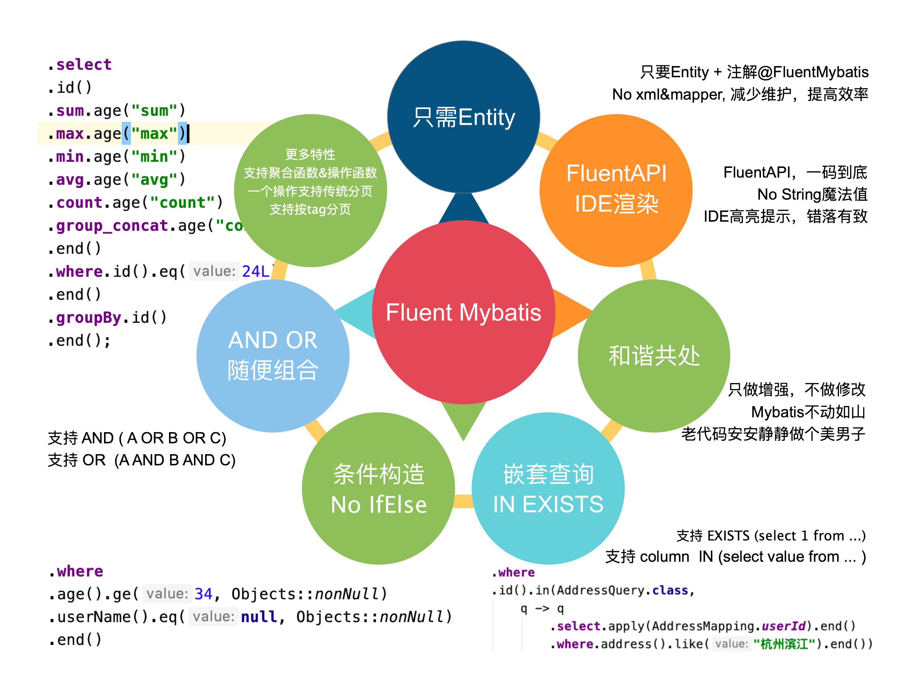

# Fluent-Mybatis, QQ交流群: 312885450
- [gitee](https://gitee.com/fluent-mybatis)
- [github](https://github.com/atool/fluent-mybatis)
- [FluentMybatis示例](https://gitee.com/fluent-mybatis/fluent-mybatis-docs)

# [FluentMybatis特性](https://gitee.com/fluent-mybatis/fluent-mybatis/wikis/fluent%20mybatis%E7%89%B9%E6%80%A7%E6%80%BB%E8%A7%88?sort_id=4216053)

# [语法手册](https://gitee.com/fluent-mybatis/fluent-mybatis/wikis)
## 环境部署
- [Maven工程](https://gitee.com/fluent-mybatis/fluent-mybatis/wikis/Maven%E5%B7%A5%E7%A8%8B?sort_id=4098217)
- [Gradle工程](https://gitee.com/fluent-mybatis/fluent-mybatis/wikis/Gradle%E5%B7%A5%E7%A8%8B?sort_id=4098231)
- [代码生成(简单)](https://gitee.com/fluent-mybatis/fluent-mybatis/wikis/%E4%BB%A3%E7%A0%81%E7%94%9F%E6%88%90(%E7%AE%80%E5%8D%95)?sort_id=4098246)
- [简单示例](https://gitee.com/fluent-mybatis/fluent-mybatis/wikis/%E7%AE%80%E5%8D%95%E7%A4%BA%E4%BE%8B?sort_id=4098265)
- [非Spring工程](https://gitee.com/fluent-mybatis/fluent-mybatis/wikis/%E9%9D%9ESpring%E5%B7%A5%E7%A8%8B?sort_id=4201851)
- [mybatis原生mapper加载](https://gitee.com/fluent-mybatis/fluent-mybatis/wikis/mybatis%E5%8E%9F%E7%94%9Fmapper%E5%8A%A0%E8%BD%BD?sort_id=4201901)

## 代码生成设置
- [基本生成配置](https://gitee.com/fluent-mybatis/fluent-mybatis/wikis/%E5%9F%BA%E6%9C%AC%E7%94%9F%E6%88%90%E9%85%8D%E7%BD%AE?sort_id=4151752)
- [默认查询,更新条件设置](https://gitee.com/fluent-mybatis/fluent-mybatis/wikis/%E9%BB%98%E8%AE%A4%E6%9F%A5%E8%AF%A2,%E6%9B%B4%E6%96%B0%E6%9D%A1%E4%BB%B6%E8%AE%BE%E7%BD%AE?sort_id=4151558)
- [自定义Entity后缀](https://gitee.com/fluent-mybatis/fluent-mybatis/wikis/%E8%87%AA%E5%AE%9A%E4%B9%89Entity%E5%90%8E%E7%BC%80?sort_id=4151663)
- [多数据库支持](https://gitee.com/fluent-mybatis/fluent-mybatis/wikis/%E5%A4%9A%E6%95%B0%E6%8D%AE%E5%BA%93%E6%94%AF%E6%8C%81?sort_id=4151671)
- [使用自定义数据源生成代码](https://gitee.com/fluent-mybatis/fluent-mybatis/wikis/%E4%BD%BF%E7%94%A8%E8%87%AA%E5%AE%9A%E4%B9%89%E6%95%B0%E6%8D%AE%E6%BA%90%E7%94%9F%E6%88%90%E4%BB%A3%E7%A0%81?sort_id=4151763)
- [表特殊字段定义](https://gitee.com/fluent-mybatis/fluent-mybatis/wikis/%E8%A1%A8%E7%89%B9%E6%AE%8A%E5%AD%97%E6%AE%B5%E5%AE%9A%E4%B9%89?sort_id=4151767)
- [自定义字段](https://gitee.com/fluent-mybatis/fluent-mybatis/wikis/%E8%87%AA%E5%AE%9A%E4%B9%89%E5%AD%97%E6%AE%B5?sort_id=4156301)
- [主键设置](https://gitee.com/fluent-mybatis/fluent-mybatis/wikis/%E4%B8%BB%E9%94%AE%E8%AE%BE%E7%BD%AE?sort_id=4169686)
- [TypeHandler支持](https://gitee.com/fluent-mybatis/fluent-mybatis/wikis/TypeHandler%E6%94%AF%E6%8C%81?sort_id=4156262)

## Mapper类语法
#### 增
- [insert](https://gitee.com/fluent-mybatis/fluent-mybatis/wikis/insert?sort_id=4098272)
- [insertWithPk](https://gitee.com/fluent-mybatis/fluent-mybatis/wikis/insertWithPk?sort_id=4098282)
- [insertBatch](https://gitee.com/fluent-mybatis/fluent-mybatis/wikis/insertBatch?sort_id=4098283)
- [insertBatchWithPk](https://gitee.com/fluent-mybatis/fluent-mybatis/wikis/insertBatchWithPk?sort_id=4098292)
- [insertSelect](https://gitee.com/fluent-mybatis/fluent-mybatis/wikis/insertSelect?sort_id=4098294)
- [save](https://gitee.com/fluent-mybatis/fluent-mybatis/wikis/save?sort_id=4098708)
- [saveOrUpdate](https://gitee.com/fluent-mybatis/fluent-mybatis/wikis/saveOrUpdate?sort_id=4098705)

#### 删
- [deleteById](https://gitee.com/fluent-mybatis/fluent-mybatis/wikis/deleteById?sort_id=4098298)
- [deleteByIds](https://gitee.com/fluent-mybatis/fluent-mybatis/wikis/deleteByIds?sort_id=4098300)
- [deleteByMap](https://gitee.com/fluent-mybatis/fluent-mybatis/wikis/deleteByMap?sort_id=4098302)
- [delete](https://gitee.com/fluent-mybatis/fluent-mybatis/wikis/delete?sort_id=4098306)
- [deleteByEntityIds](https://gitee.com/fluent-mybatis/fluent-mybatis/wikis/deleteByEntityIds?sort_id=4098697)
- [deleteByMapAndDefault](https://gitee.com/fluent-mybatis/fluent-mybatis/wikis/deleteByMapAndDefault?sort_id=4098698)

#### 逻辑删除
- [逻辑删除代码生成配置](https://gitee.com/fluent-mybatis/fluent-mybatis/wikis/%E9%80%BB%E8%BE%91%E5%88%A0%E9%99%A4%E4%BB%A3%E7%A0%81%E7%94%9F%E6%88%90%E9%85%8D%E7%BD%AE?sort_id=4151541)
- [logicDeleteById](https://gitee.com/fluent-mybatis/fluent-mybatis/wikis/logicDeleteById?sort_id=4151529)
- [logicDeleteByIds](https://gitee.com/fluent-mybatis/fluent-mybatis/wikis/logicDeleteByIds?sort_id=4151530)
- [logicDeleteByMap](https://gitee.com/fluent-mybatis/fluent-mybatis/wikis/logicDeleteByMap?sort_id=4151531)
- [logicDelete](https://gitee.com/fluent-mybatis/fluent-mybatis/wikis/logicDelete?sort_id=4151532)
- [logicDeleteByMapAndDefault](https://gitee.com/fluent-mybatis/fluent-mybatis/wikis/logicDeleteByMapAndDefault?sort_id=4151533)
- [logicDeleteByEntityIds](https://gitee.com/fluent-mybatis/fluent-mybatis/wikis/logicDeleteByEntityIds?sort_id=4151534)

#### 改
- [updateBy](https://gitee.com/fluent-mybatis/fluent-mybatis/wikis/updateBy?sort_id=4098309)
- [updateById](https://gitee.com/fluent-mybatis/fluent-mybatis/wikis/updateById?sort_id=4098310)
- [使用乐观锁](https://gitee.com/fluent-mybatis/fluent-mybatis/wikis/%E4%BD%BF%E7%94%A8%E4%B9%90%E8%A7%82%E9%94%81?sort_id=4151525)

#### 查
- [findById](https://gitee.com/fluent-mybatis/fluent-mybatis/wikis/findById?sort_id=4098394)
- [findOne](https://gitee.com/fluent-mybatis/fluent-mybatis/wikis/findOne?sort_id=4098398)
- [listByIds](https://gitee.com/fluent-mybatis/fluent-mybatis/wikis/listByIds?sort_id=4098408)
- [listByMap](https://gitee.com/fluent-mybatis/fluent-mybatis/wikis/listByMap?sort_id=4098517)
- [listEntity](https://gitee.com/fluent-mybatis/fluent-mybatis/wikis/listEntity?sort_id=4098520)
- [listMaps](https://gitee.com/fluent-mybatis/fluent-mybatis/wikis/listMaps?sort_id=4098527)
- [listObjs](https://gitee.com/fluent-mybatis/fluent-mybatis/wikis/listObjs?sort_id=4098577)
- [count](https://gitee.com/fluent-mybatis/fluent-mybatis/wikis/count?sort_id=4098584)
- [countNoLimit](https://gitee.com/fluent-mybatis/fluent-mybatis/wikis/countNoLimit?sort_id=4098643)
- [existPk](https://gitee.com/fluent-mybatis/fluent-mybatis/wikis/existPk?sort_id=4098699)

####  分页方法
- [stdPagedEntity](https://gitee.com/fluent-mybatis/fluent-mybatis/wikis/stdPagedEntity?sort_id=4098733)
- [stdPagedMap](https://gitee.com/fluent-mybatis/fluent-mybatis/wikis/stdPagedMap?sort_id=4098734)
- [stdPagedPoJo](https://gitee.com/fluent-mybatis/fluent-mybatis/wikis/stdPagedPoJo?sort_id=4098735)
- [tagPagedEntity](https://gitee.com/fluent-mybatis/fluent-mybatis/wikis/tagPagedEntity?sort_id=4098738)
- [tagPagedMap](https://gitee.com/fluent-mybatis/fluent-mybatis/wikis/tagPagedMap?sort_id=4098741)
- [tagPagedPoJo](https://gitee.com/fluent-mybatis/fluent-mybatis/wikis/tagPagedPoJo?sort_id=4098742)

#### 工具方法
- [defaultQuery](https://gitee.com/fluent-mybatis/fluent-mybatis/wikis/defaultQuery?sort_id=4098689)
- [query](https://gitee.com/fluent-mybatis/fluent-mybatis/wikis/query?sort_id=4098690)
- [defaultUpdater](https://gitee.com/fluent-mybatis/fluent-mybatis/wikis/defaultUpdater?sort_id=4098691)
- [updater](https://gitee.com/fluent-mybatis/fluent-mybatis/wikis/updater?sort_id=4098693)

##  Select语法
- [select字段](https://gitee.com/fluent-mybatis/fluent-mybatis/wikis/select%E5%AD%97%E6%AE%B5?sort_id=4101591)
- [聚合函数](https://gitee.com/fluent-mybatis/fluent-mybatis/wikis/%E8%81%9A%E5%90%88%E5%87%BD%E6%95%B0?sort_id=4101749)
- [自由定义apply](https://gitee.com/fluent-mybatis/fluent-mybatis/wikis/%E8%87%AA%E7%94%B1%E5%AE%9A%E4%B9%89apply?sort_id=4102496)

##  where语法
- [where设置](https://gitee.com/fluent-mybatis/fluent-mybatis/wikis/where%E8%AE%BE%E7%BD%AE?sort_id=4102593)
- [基本条件设置](https://gitee.com/fluent-mybatis/fluent-mybatis/wikis/%E5%9F%BA%E6%9C%AC%E6%9D%A1%E4%BB%B6%E8%AE%BE%E7%BD%AE?sort_id=4102602)
- [exists 和 in 子查询](https://gitee.com/fluent-mybatis/fluent-mybatis/wikis/exists%20%E5%92%8C%20in%20%E5%AD%90%E6%9F%A5%E8%AF%A2?sort_id=4106029)
- [eqByEntity](https://gitee.com/fluent-mybatis/fluent-mybatis/wikis/eqByEntity?sort_id=4176611)
- [eqByExclude](https://gitee.com/fluent-mybatis/fluent-mybatis/wikis/eqByExclude?sort_id=4176639)
- [and(子条件) or(子条件)](https://gitee.com/fluent-mybatis/fluent-mybatis/wikis/and(%E5%AD%90%E6%9D%A1%E4%BB%B6)%20or(%E5%AD%90%E6%9D%A1%E4%BB%B6)?sort_id=4106034)
- [apply: 自定义条件](https://gitee.com/fluent-mybatis/fluent-mybatis/wikis/apply:%20%E8%87%AA%E5%AE%9A%E4%B9%89%E6%9D%A1%E4%BB%B6?sort_id=4106035)
- [applyFunc: 设置函数条件](https://gitee.com/fluent-mybatis/fluent-mybatis/wikis/applyFunc:%20%E8%AE%BE%E7%BD%AE%E5%87%BD%E6%95%B0%E6%9D%A1%E4%BB%B6?sort_id=4106039)
- [按条件设置查询项](https://gitee.com/fluent-mybatis/fluent-mybatis/wikis/%E6%8C%89%E6%9D%A1%E4%BB%B6%E8%AE%BE%E7%BD%AA5%E8%AF%A2%E9%A1%B9?sort_id=4106038)

## having条件
- [having基本语法](https://gitee.com/fluent-mybatis/fluent-mybatis/wikis/having%E5%9F%BA%E6%9C%AC%E8%AF%AD%E6%B3%95?sort_id=4219385)
- [applyFunc](https://gitee.com/fluent-mybatis/fluent-mybatis/wikis/applyFunc?sort_id=4219467)
- [使用子查询](https://gitee.com/fluent-mybatis/fluent-mybatis/wikis/%E4%BD%BF%E7%94%A8%E5%AD%90%E6%9F%A5%E8%AF%A2?sort_id=4219468)

##  更新语法
- [更新字段设置](https://gitee.com/fluent-mybatis/fluent-mybatis/wikis/%E6%9B%B4%E6%96%B0%E5%AD%97%E6%AE%B5%E8%AE%BE%E7%BD%AE?sort_id=4169719)
- [byEntity](https://gitee.com/fluent-mybatis/fluent-mybatis/wikis/byEntity?sort_id=4176650)
- [byExclude](https://gitee.com/fluent-mybatis/fluent-mybatis/wikis/byExclude?sort_id=4176651)
- [applyFunc](https://gitee.com/fluent-mybatis/fluent-mybatis/wikis/applyFunc?sort_id=4176831)
- [根据条件更新](https://gitee.com/fluent-mybatis/fluent-mybatis/wikis/%E6%A0%B9%E6%8D%AE%E6%9D%A1%E4%BB%B6%E6%9B%B4%E6%96%B0?sort_id=4176832)

##  关联查询
- [inner join](https://gitee.com/fluent-mybatis/fluent-mybatis/wikis/inner+join?sort_id=4178540)
- [left&right join](https://gitee.com/fluent-mybatis/fluent-mybatis/wikis/left%26right+join?sort_id=4178707)
- [join on条件设置](https://gitee.com/fluent-mybatis/fluent-mybatis/wikis/join%20on%E6%9D%A1%E4%BB%B6%E8%AE%BE%E7%BD%AE?sort_id=4178708)
- [多个join结合](https://gitee.com/fluent-mybatis/fluent-mybatis/wikis/%E5%A4%9A%E4%B8%AAjoin%E7%BB%93%E5%90%88?sort_id=4178709)

##  充血Entity模型
- [在Query和Updater上直接执行Mapper方法](https://gitee.com/fluent-mybatis/fluent-mybatis/wikis/%E5%9C%A8Query%E5%92%8CUpdater%E4%B8%8A%E7%9B%B4%E6%8E%A5%E6%89%A7%E8%A1%8CMapper%E6%96%B9%E6%B3%95?sort_id=4201867)
- [Entity一对一关联](https://gitee.com/fluent-mybatis/fluent-mybatis/wikis/Entity%E4%B8%80%E5%AF%B9%E4%B8%80%E5%85%B3%E8%81%94?sort_id=4201868)
- [Entity一对多关联](https://gitee.com/fluent-mybatis/fluent-mybatis/wikis/Entity%E4%B8%80%E5%AF%B9%E5%A4%9A%E5%85%B3%E8%81%94?sort_id=4201869)
- [Entity多对多关联](https://gitee.com/fluent-mybatis/fluent-mybatis/wikis/Entity%E5%A4%9A%E5%AF%B9%E5%A4%9A%E5%85%B3%E8%81%94?sort_id=4201870)

## 其它
- [FreeQuery/FreeUpdate](https://gitee.com/fluent-mybatis/fluent-mybatis/wikis/FreeQuery&FreeUpdate?sort_id=4219518)
- [自定义完整SQL](https://gitee.com/fluent-mybatis/fluent-mybatis/wikis/%E8%87%AA%E5%AE%9A%E4%B9%89%E5%AE%8C%E6%95%B4SQL?sort_id=4219481)
- [union](https://gitee.com/fluent-mybatis/fluent-mybatis/wikis/union?sort_id=4219716)
- [存储过程 callProcedure](https://gitee.com/fluent-mybatis/fluent-mybatis/wikis/%E5%AD%98%E5%82%A8%E8%BF%87%E7%A8%8B+crocedure?sort_id=4098655)
- [批量增删改查 batchCrud](https://gitee.com/fluent-mybatis/fluent-mybatis/wikis/%E6%89%B9%E9%87%8F%E5%A2%9E%E5%88%A0%E6%94%B9%E6%9F%A5%20batchCrud?sort_id=4098685)

##  数据测试
- [如何执行FluentMybatis工程中的测试](https://gitee.com/fluent-mybatis/fluent-mybatis/wikis/%E5%A6%82%E4%BD%95%E6%89%A7%E8%A1%8CFluentMybatis%E5%B7%A5%E7%A8%8B%E4%B8%AD%E7%9A%84%E6%B5%8B%E8%AF%95?sort_id=4219724)

# 其它
- [release note](https://gitee.com/fluent-mybatis/fluent-mybatis/wikis/release%20note?sort_id=4216055)
- [掘金系列文章](https://juejin.im/user/1811586730696142/posts)