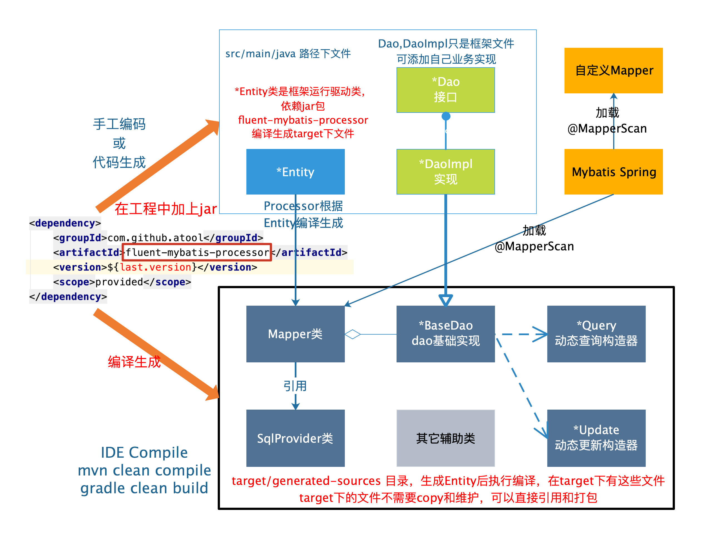

# Fluent-Mybatis介绍

## QQ交流群: 312885450
[语法手册, 完善中](https://gitee.com/fluent-mybatis/fluent-mybatis/wikis)

[FluentMybatis文档](https://gitee.com/fluent-mybatis/fluent-mybatis-docs)
    
[掘金系列文章](https://juejin.im/user/1811586730696142/posts)

[gitee](https://gitee.com/fluent-mybatis)

[github](https://github.com/atool/fluent-mybatis)

## FluentMybatis特性

## FluentMybatis原理

## Fluent-Mybatis 历程

[release note](release/v1.5.x.md)

- [1.5.x 版本](release/v1.5.x.md), 存储过程，Join特性，多条语句批处理，insert select，Union等更多特性支持
- 1.4.3 版本, 支持java 9+编译生成代码
- 1.4.2 版本, 增加一对一, 一对多和多对多支持
- 1.4.1 版本, 特性升级, 增加join, left join, right join连表查询; 支持自定义默认查询条件，更新条件。
- 1.3.x 版本, 重大改版, 语法和1.2.x一样， 但不再生成大量的java类，只需要一个Entity，借助java的processor功能，就实现了强大的fluent形式的增删改查操作。
- 1.2.x 版本, 在使用了一段时间后, 对fluent mybatis语法进行了比较大的调整, 语法结构已经稳定。但需要借助代码生成器，生成一系列文件。
- 1.0.x 版本, 借鉴了mybatis plus和tk mybatis的思想, 但基于Fluent API方式进行了重新开发。
