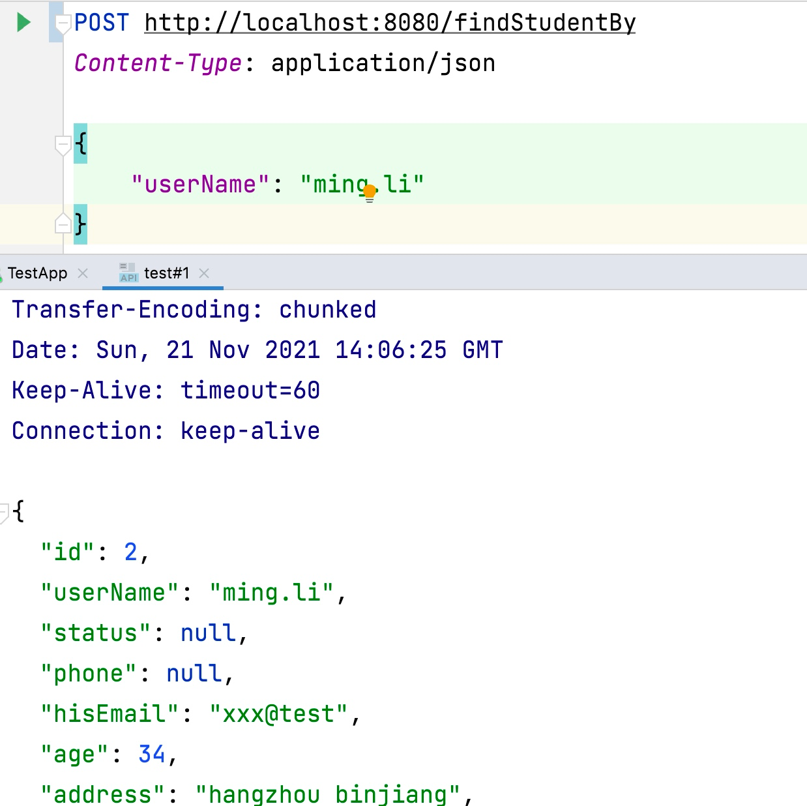

# 还在CRUD吗? 给你一招一剑封喉，彻底摆脱简单的增删改查

    小明接了个项目，业务方的需求里面有很多组织管理、人员管理、事件管理的需求，这些业务有面向终端客户的查询，也有面向内部管理人员的管理。需求的复杂度不高，很多都是单表的增删改查，但架不住需求点太多，小明还是得加班加点的当搬砖码农。其实，针对这类场景，有很多公司尝试使用打破分层界限的编码工具，比如宇宙第一编码语言PHP、ruby/rails等，方便快捷，奈何业务复杂了以后，都得慢慢迁移到企业级开发语言java上。也有公司，开始尝试低代码平台，通过简单的托拉拽就完成后台管理界面的开发，奈何，现在的低代码开发还真只能胜任上面需求中的增删改查。
    有没有一种办法，在java的企业级开发中，既能满足复杂的需求开发；又可以快速的完成简单的增删改查（有一定的业务逻辑），同时能保证技术的统一性和延续性呢？ fluent-mybatis在完成了对mybatis封装，实现了在java代码中使用流式语言，满足条件设置、复杂关联、嵌套、union、多数据库支持、个性化扩展等便捷能力外。现在又推出了，专门面向表单级的增删改查，声明即实现的一剑封喉的能力。
    哎呀，是不是作者吹牛不用上税啊，我们来看个简单的例子：
    
    我们定义一个spring rest api接口如下

```java
@RestController
@FormService(table = "student")
public interface StudentQueryApi {
    @PostMapping("/student")
    Student findStudentBy(@RequestBody StudentQuery student);
}

@Data
@Accessors(chain = true)
public class StudentQuery implements Serializable {
    private String userName;

    @Entry(type = EntryType.LikeLeft)
    private String address;

    @Entry(type = Between)
    private Integer[] age;

    private Integer gender;
    /**
     * 默认正序
     */
    @Entry(type = EntryType.OrderBy, name = "userName")
    private boolean byUserName = true;
    /**
     * 默认倒序
     */
    @Entry(type = EntryType.OrderBy, name = "age")
    private boolean byAge;
}

@Data
@Accessors(chain = true)
public class Student implements Serializable {

    private String userName;

    private String status;

    private String phone;

    @Entry(name = "email")
    private String hisEmail;

    private Integer age;

    private String address;
}
```

然后用@FormServiceScan注解把API路径加入到spring configuration中, 用法和mybatis的@MapperScan类似

```java
@FormServiceScan({"你定义api的package路径"})
public class SpringConfig {
    // 你其它bean配置
}
```
很简单，虽然你仅仅是定义了一个接口，没有写一行实现代码，你已经完整的实现了一个查询逻辑。查询入参包括了，相等条件，between条件，like条件和排序设置。

启动springboot应用，我们用rest client调用一下看看



是不是很简单，声明即实现，对于单表的CRUD，产品画完原型，开发也基本实现完了，form-service功能也算一种低代码实现框架了。

下面我们重点将一下form-service的核心概念

- @FormService, 定义在接口类上, 表明该接口是个FormService接口
- @FormServiceScan, 定义在Spring的@Configuration类上，功能类似Mybatis的@MapperScan，用来扫描所有的@FormService接口
- @FormMethod，可选，定义在Service方法上，如果是插入或更新方法，必须声明，如果是查询方法，无需声明
- @Entry，可选，定义在表单字段上，在下列场景下需要显式定义@Entry
    1. 条件字段，条件不是相等，而是大于，小于，between等
    2. 表单字段名称和Entity字段名称不一致
    3. 分页条件字段（页码，每页数量）
    4. 排序字段
    5. 更新字段

同时，在接口和属性上，除了可以定义form-service的注解外，还需要有下面增强
- 还可以结合spring rest注解 @RestController+@PostMapping，直接将接口暴露为rest api
- 结合javax.validate注解，实现入参的合法性校验


    


